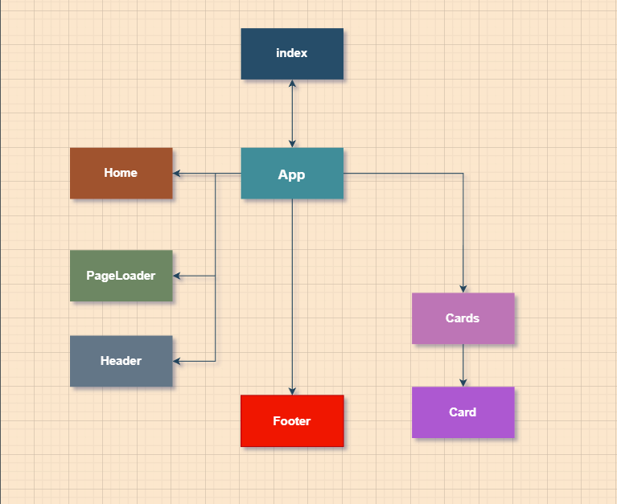

<h1>ZappRecall React</h1>

<h4>A ideia do App é ler a pergunta ou afirmação e tentar lembrar da reposta.</h4>
 

Diagrama do App

<a href="https://projeto9-zaprecallreact.vercel.app/">Vercel Link Aplication</a>

